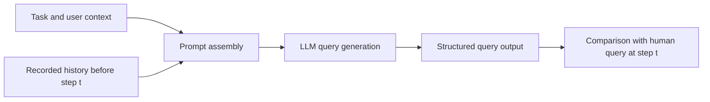

# LLM Search Query Simulation

### Modelling how people formulate and reformulate search queries

How closely can a language model reproduce the next query a person would submit during a search session?

My 2024 undergraduate thesis at **Renmin University of China** investigated this question by combining recorded search histories with an LLM-based query simulator, probabilistic baselines and controlled prompt ablations. The system uses the task, user context and earlier search interactions to generate a query, then compares it with the corresponding human query.

**Author:** Jingfan Xin | **Supervisor:** Jiaxin Mao

**Programme:** Artificial Intelligence, Gaoling School of Artificial Intelligence

**Original thesis:** *Search User Query Behaviour Simulation Based on Large Language Models*

## What I implemented

- A **history-conditioned query simulator** that assembles task instructions, user context, prior queries, clicked-page information and user feedback into structured prompts.
- **Prompt ablations** testing the contribution of recorded rationales, feedback, observations, user profiles, examples and generated rationale output.
- **Probabilistic query-generation baselines** using task-specific text corpora, random or frequency-based term selection and sampled query lengths.
- A **data-processing and evaluation pipeline** for extracting queries, checking annotation completeness, processing model responses and comparing lexical and semantic similarity.

The study used a human search dataset with recorded interactions and verbal reports. The thesis reports 30 participants and 10 tasks. The surviving files distinguish a **737-query reference export** from a **713-query standard simulation/evaluation set**; these are documented separately rather than treated as one identical dataset.

## How it works



This is **offline next-query simulation conditioned on recorded human history**, not an autonomous browser agent. Generated queries are not fed back into a live search environment in the retained main experiment.

## What the experiments showed

The thesis reports higher query-similarity scores for its LLM approach than for the two probabilistic baselines. More importantly, the experiments exposed useful design trade-offs:

- Query-only output performed better than generating an explicit rationale before the query in the reported standard comparison.
- Removing individual context components generally made only small differences; richer prompts were not consistently better.
- Example choice and query position mattered, and simulated queries were less diverse than human queries.

These are findings within this study's evaluation setup, not a claim of improved live-search performance. Saved outputs support several reported scores, but dataset versions and comparison protocols require care. See [Experiments and findings](docs/EXPERIMENTS.md).

## Technology

**Python | OpenAI API | jieba | NLTK | PyTorch | BERTScore | SciPy | pandas | SQLite**

The historical model was `gpt-3.5-turbo-0125`; semantic evaluation used `bert-base-chinese`. The project did not train or fine-tune a foundation model. Django/SQLite belonged to the study's data-collection environment, which is not republished as a newly authored application here.

## Explore the repository

- [Architecture and code map](docs/ARCHITECTURE.md)
- [Experiments, results and ablation interpretation](docs/EXPERIMENTS.md)
- [English prompt-design guide](docs/PROMPT_DESIGN.md)
- [Reproducibility and known issues](docs/REPRODUCIBILITY.md)
- [Provenance, privacy and attribution](docs/PROVENANCE.md)
- [Historical Python implementation](legacy/README.md)

## Try it without an API key

The small **2026 review demo** exercises the original history/prompt assembly methods with a completely synthetic example. It does not contact an API, download models or access participant data.

```bash
python3 -B tools/preview_prompt.py --variant standard --step 2
python3 -B -m unittest discover -s tests -v
python3 -B tools/verify_repository.py
```

Add `--show-prompt` to inspect the assembled prompt. Documentation is in English; historical Chinese prompt templates are retained because their wording was part of the experiment.

## Publication status

This public repository was curated in **September 2026**. It includes sanitised historical source, English documentation, aggregate results and new offline review utilities. It excludes participant records, recordings, embedded session examples, credentials and third-party project copies. The historical live-generation pipeline has not been certified as runnable end to end; see the [reproducibility notes](docs/REPRODUCIBILITY.md).
