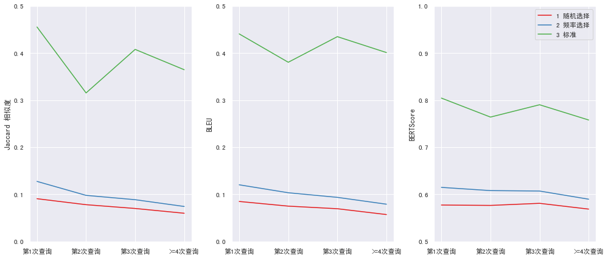
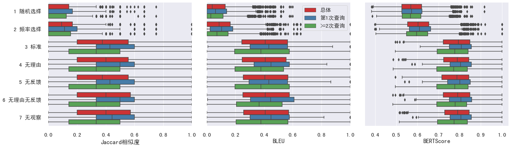
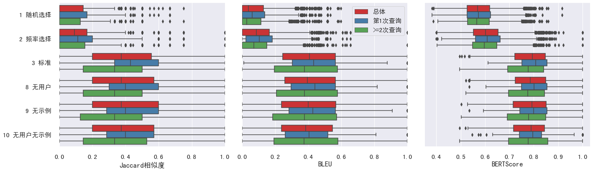

# Experiments and findings

## Evidence levels

- **Thesis-reported:** transcribed from the final thesis, particularly tables 2–5 and chapters 5–6.
- **Archive-checked:** counts or aggregates recomputed from retained JSON files in September 2026.
- **Not rerun:** model generation, tokenisation-dependent evaluations and baseline sampling were not repeated for this publication.

The thesis is source T01 in the [evidence manifest](../evidence-manifest.json). Private source paths and participant-level records are excluded.

## Research data

The study collected interactions on ten information-seeking tasks, covering topics such as sustainability, animal protection, home technology, plants and computing. Participants formulated queries, examined search results and described their reasons and feedback. The data-collection environment used a Django/SQLite annotation platform and Sogou search results. This repository focuses on query simulation and evaluation, not republication or sole-authorship claims for that platform.

| Quantity | Thesis, table 2 | Retained reference export D01 | Retained simulation input D02 |
| --- | ---: | ---: | ---: |
| Participants | 30 | 30 | 30 |
| Sessions | 292 | 292 | 290 |
| Query records | 737 | 737 | 713 |
| Distinct query strings | 502 | 493 | 486 |
| Available pre-query rationales | 456 | No rationale text in this version | 456 under the legacy completeness rule |
| Available post-query feedback | 683 | No feedback text in this version | 683 under the legacy completeness rule |

The completeness rule excludes empty fields and the archive's explicit “participant did not say” marker. Merely counting non-empty strings would count placeholders and produce different numbers. D02 contains 1,397 clicked-result entries, matching the thesis's reported clicked-page count. Its 6,710 total result entries are not interchangeable with the thesis's 4,521 “pages”; that definition/version remains unresolved.

The standard cleaned output D03 contains **713 generated-query records across 290 sessions**, not 737. Its 349 distinct literal queries also differ from the thesis table 3 figure of 356. These differences are retained in [data-audit.json](../results/data-audit.json), not silently normalised or filled with invented records.

## Baselines and LLM conditions

The historical LLM configuration was `gpt-3.5-turbo-0125`. The main comparison used query-only output at temperature 1. Separate experiments requested both a rationale and a query and varied temperature between 0.5, 1 and 1.5.

The two probabilistic baselines sampled terms from task-related corpora, with either uniform selection over vocabulary or selection influenced by term frequency. Query lengths were sampled, and corpus weights were searched using a BLEU-based criterion. The thesis reports ten times as many baseline queries as human queries. These baselines do not receive the same per-user, per-step historical context as the LLM.

## Selected reported results

| Condition | Jaccard | BLEU | BERTScore |
| --- | ---: | ---: | ---: |
| Random term baseline | 0.072 | 0.075 | 0.576 |
| Frequency-based term baseline | 0.108 | 0.108 | 0.608 |
| Standard, query-only LLM | 0.394 | 0.418 | 0.784 |
| LLM with rationale output, temperature 1 | 0.362 | 0.371 | 0.766 |

Source: thesis table 4, PDF page 28 / printed page 21, visually checked during the review. All fourteen rows, including ablations, are transcribed in [thesis-table-4.csv](../results/thesis-table-4.csv).

The saved standard outputs independently support the rounded standard row: Jaccard **0.394324**, BLEU **0.417798** and BERTScore **0.784151**, each associated with 713 query scores. Here, Jaccard is a mean of task means; BLEU and BERTScore are means over saved query scores. This is an aggregate cross-check, not fresh model inference or an independent implementation of the metrics.

## Archived figure outputs

These are byte-for-byte copies of the chart files used in the final thesis. Their Chinese labels and original rendering are intentionally preserved. The figures visualise thesis-era outputs; they were not regenerated from the public aggregate files and should be interpreted with the evidence and cohort caveats below.

*Figure 5 compares the two probabilistic baselines with the standard LLM condition at the first, second, third and fourth-or-later query positions.*

*Figure 12 shows Jaccard, BLEU and BERTScore distributions for the standard condition and ablations of rationale, feedback and observation inputs, with the two baselines included for context.*

*Figure 13 shows the corresponding distributions for profile and example ablations, again with the two baselines included for context.*

The thesis also includes two exploratory participant-background summaries:

- [Mean queries per task by background category](../assets/results/mean-queries-by-background.png) (figure 14)
- [Mean result-page clicks by background category](../assets/results/mean-clicks-by-background.png) (figure 15)

These last two charts expose category-level means only, not participant rows or identifiers. They do not report subgroup sample sizes, uncertainty or significance tests, so they should be treated as descriptive exploration rather than evidence of demographic effects.

## What is worth taking away

### 1. History-conditioned generation is a useful query-simulation approach

The study's LLM produced queries closer to recorded human queries on the reported similarity measures than its term-sampling baselines. However, the contextual information, sample sizes and pairing protocols differ. The comparison supports a result within this setup, not a clean isolated estimate of the effect of replacing one model with another.

### 2. More prompt content was not consistently better

Most single-component ablations produced small changes. For example, the reported no-profile and no-example conditions were close to the standard setting, and neither was uniformly worse across the three metrics. The evidence does not support claiming a large demonstrated personalisation gain merely because profile information was included.

### 3. Explicit rationale output could reduce query similarity

The reported query-only standard condition scored higher than the rationale-output condition at temperature 1. The thesis discusses examples in which generated rationales misinterpret the task. This is a study-specific observation, not a general claim that reasoning is harmful or that generated explanations reveal a model's internal process.

### 4. Query position and diversity deserve separate evaluation

The thesis reports stronger matching for initial queries, a drop at the second query and a later recovery. Since later prompts receive additional **human** history, this should not be described as evidence that the model autonomously learned from its own earlier actions. Both the report and the retained output also indicate less query diversity than the human reference.

## Important result caveats

- The “mismatched example” condition has **471** saved scores, while the usual standard condition has 713. Temperature 1.5 has **712**. Thus, interpreting score changes as isolated prompt effects requires a rerun on a matched set of query steps.
- The no-recorded-rationale condition's retained BERTScore mean is about **0.783431**, whereas thesis table 4 gives 0.782. It is preserved as a source discrepancy, not rounded away.
- The saved baseline Jaccard routine applies an `i < j` restriction when crossing two different query collections. That is appropriate for avoiding duplicate pairs within one set, but not for enumerating all pairs across two separate sets.
- The retained BLEU implementation passes strings directly to NLTK, making the evaluated sequence units characters rather than explicitly tokenised Chinese words. Scores should not be relabelled as standard word-level BLEU.
- BERTScore baseline comparison uses positional pairing of candidate/reference lists; increasing batch size does not turn it into a permutation-invariant comparison of sets.
- No verified run manifest, fixed data split, uncertainty analysis or exact historical dependency lockfile was recovered. Small ablation differences are not presented here as statistically established improvements.

The [saved-score audit](../results/saved-score-audit.json) separates retained aggregates from thesis transcription. [Reproducibility notes](REPRODUCIBILITY.md) explain what a defensible replication would need to resolve.
